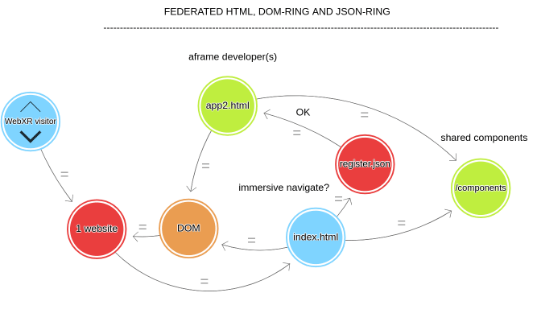

## deadsimple immersive navigation


A singleplayer-verse-in-a-repo:

* try the [ONLINE DEMO](https://coderofsalvation.github.io/aframe-verse/apps/)
* serverless: no servers (NAF/signaling) needed
* don't exit immersive mode when navigating to different aframe experience 
* teleporting between aframe apps & aframe verses 

> Similar to a **WEB**ring, aframe-verse-component basically enables a **DOM**-ring and a **VERSE**-ring

## Example

```
<script src="aframe-verse-component"></script>

<a-scene>
  <a-entity aframe-verse="register: /aframe-verse.json">

    <!-- everything nested under `aframe-verse`, will be replaced upon navigation -->

    <a-box href="./app2.html"></a-box>
    <a-box href="https://somefriend.com/some_aframe_app.html"></a-box>
    <a-box href="https://somefriend.com/supercustom_webxr_app.html"></a-box>

  <a-entity>

  <!-- put 'global' entities here (UI, cursor or wearables e.g.)   -->
  <!-- which persist across experiences                            -->

</a-scene>
```

yourregister.json
```
{
  "schema":"aframe-verse/0.1",
  "destinations":[ 
    {"url":"./index.html"},
    {"url":"somefriend.com/some_aframe_app.html"},         // allow in-app immersive navigation
    {
     "url":"somefriend.com/supercustom_webxr_app.html",    // a trusted app but which uses 
     "owntab": true                         
    }
  ], 
  "verses":["https://otherbefriendedverse.com/register.json"]
}
```

## Forking your own aframe-verse

* click the fork-button on this repository
* rename the repository to `aframe-verse-*` (aframe-verse-myorganisation e.g.) for easy discoverability
* in github settings, enable github pages (use the main-branch)

> your verse can now be accessed thru `https://yourusername.github.io/aframe-verse-myorganisation/apps`

* put your aframe apps in `apps/*`
* add `href`-attributes to clickable items (like a-box)
* whitelist the href-attributes by including them in `aframe-verse.json`

> Later: please connect your verse to this repo, by mentioning your json-URL in an issue. That way, future forks will automatically include your verse too.

## a federated monoverse

The following describes the thought-experiment of aframe-verse-component:

> describe a XYZ-verse using the lowest common denominator between authors (=a git repository)

* the **repository maintainer(s)** maintain a (monorepo) pool of aframe apps 
* the **repository maintainer(s)** allows DOM-sharing (a DOM-ring) between eachothers aframe-apps
* the **repository maintainer(s)** maintain a pool of (trusted) shared aframe components
* the **repository maintainer(s)** agree on shared garbage collection 



> Ideally, the maintainers need to approve new (website-specific) scripts/components, and include them in `index.html` when a new app arrives thru merge requests.

But..but..what about security?<br>
This is all up to the maintainers, just think of it as running a shared website.

## Scope

Out of the box, this monoverse-repo is good enough for seamlessly navigating between **simple read-only** aframe experiences (galleries, portfolios, vr movies, viewing scenes e.g.).<br>
A monoverse is the opposite of a 'metaverse'-concept (in which multiplayer-communication is fundamental).
For multiplayer, see the (way more complex) [NAF approach](https://github.com/networked-aframe) which requires you to run your own server.

