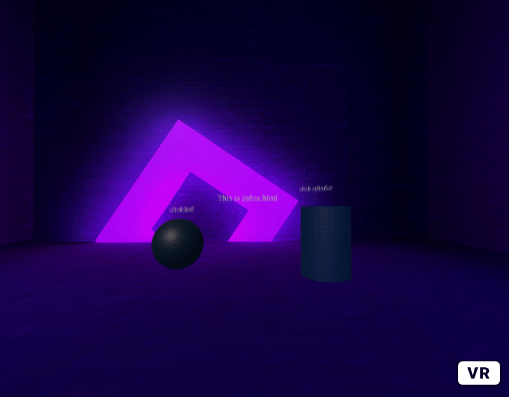
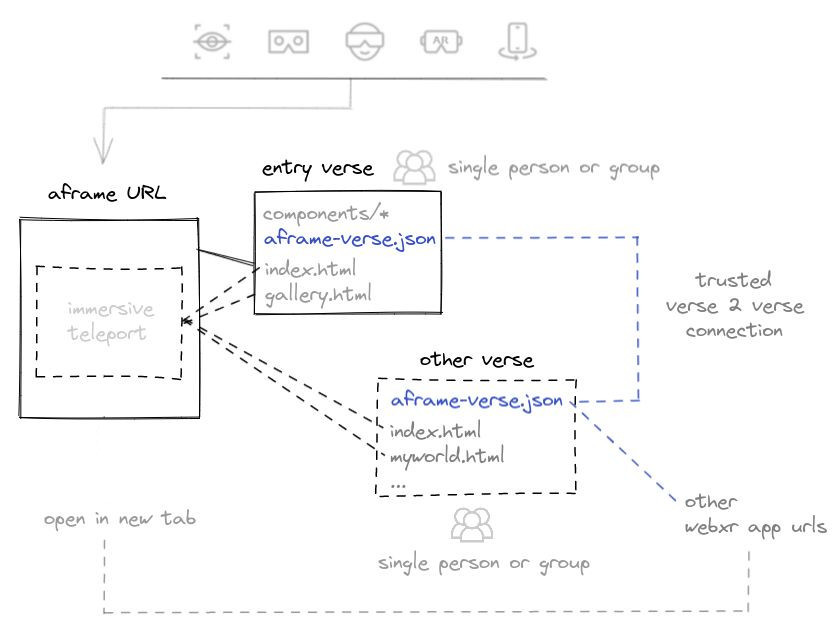

## AFRAME-verse, deadsimple immersive navigation



A single-player-verse component for [AFRAME](https://aframe.io):

### TRY THE [ONLINE DEMO](https://coderofsalvation.github.io/aframe-verse/apps/)

* ❤️ easily teleport between aframe apps & aframe-verse clusters 
* ❤️ does not exit immersive-mode when navigating to different aframe experiences
* ❤️ standalone & serverless: no servers (NAF/signaling) needed
* ❤️ HTML-first: even runs from wordpress, no ninja javascript-skills needed
* ❤️ #networkless #decentralized #noblockchain #permissionless-first #federatedpullrequests

> Similar to a **WEB**ring, you can easily create **DOM**rings and **VERSE**rings with this component, that can be **Zuckerburgered** by yourself (or friends).

<details>
  <summary><h2>Usage</h2></summary>
  <br>

```html
<script src="aframe-verse-component.js"></script>

<a-scene>
  <a-entity aframe-verse="register: /aframe-verse.json">

    <!-- everything nested under `aframe-verse`, will be replaced upon navigation  -->

    <a-box href="/"></a-box>            <!-- home = the cluster-client (index.html) -->
    <a-box href="./app2.html"></a-box>  
    <a-box href="https://somefriend.com/some_aframe_app.html"></a-box>
    <a-box href="https://somefriend.com/supercustom_webxr_app.html"></a-box>

  <a-entity>

  <!-- put 'global' entities here (UI, cursor or wearables e.g.)   -->
  <!-- to persist across navigation                                -->
  <!-- ps. multiple aframe-verse components are supported!         -->

</a-scene>
```

aframe-verse.json
```json
{
  "schema":"aframe-verse/0.1",
  "destinations":[ 
    {"url":"./index.html"},                                      
    {"url":"https://afriend.com/some_aframe_app.html"},      // allow immersive navigation
    {
     "url":"https://afriend.com/supercustom_webxr_app.html", // trusted non-aframe app e.g.
     "newtab": true                                          // (opens in new tab)
    }
  ], 
  "verses":["https://otherfriends.com/aframe-verse.json"]    // import trusted destinations
}
```

  <details>
    <summary><h4>Click here for properties</h4></summary>
    <br>

| property   | type | info |
|------------|------|------|
| debug      | bool (false) | shows info in the browserconsole     |
| register   | string | location of aframe-verse.json destinations  |
| hrefEvents | stringarray (click, collide) | events which trigger teleport to href |
| fade       | integer (100) | amount (in ms) of fade-in fade-out time       |
| fadeColor  | string ('black') | (hex)color(name) for fading       |
  </details>
  
  <details>
    <summary><h4>Click here for events</h4></summary>
    <br>

| component    | property     | promise | info                               |
|--------------|--------------|---------|------------------------------------|
| aframe-verse | registerJSON | no      |fires when loading aframe-verse JSON file(s) |
| href         | beforeNavigate | yes     |fires before navigation fadeout   |
| href         | navigate       | yes     |fires after navigation fadeout    |
| href         | loadHTML       | yes     |fires before inserting new DOM content |
| href         | loaded         | yes     |fires after all DOM content is loaded ('domready' e.g.)|

> See chapter `Customizing (with code)` > `Customizing navigation Further` for flowcontrol using promises.
  </details>
  
</details>

<details>
  <summary><h2>How it works</h2></summary>
  <br>



A visitor in an **aframe-verse** just teleports to other destinations and clusters ("*beam me up scotty!*").<br>
`aframe-verse.json` is just a telephone-book of destinations.

>  When a visitor surfs to a cluster-client ([index.html](apps/index.html)), it loads all components, which other linked experiences use.

<details>
  <summary>How does this works in large?</summary>
  <br>

  The concept above is an answer to the fact that each tile-based 'metaverse' will always turn into some kind of **hypercentralized** client-project.
  Instead, a visitor in the **aframe-verse** just teleports to other destinations and clusters.<br>
  When the visitor surfs to a cluster-client ([index.html](apps/index.html)), it basically loads all components, which other linked experiences use.<br>
  This is a security-limitation and a performance-feature, because this: 
  
  * makes traveling between experiences (within a cluster) very fluid and fast.
  * it creates a decentralized incentive between developer(s) to:
    * collaborate on a seamless & secure end-visitor cluster-client ([index.html](apps/index.html))
    * consistent UX because of:
      * shared components
      * shared global objects: wearables, UI, AR/VR controller-support e.g.
  
  > As an exception to the rule, the developer(s) (YOU) of a cluster-client ([index.html](apps/index.html)) can load remote (trusted) components/scripts, which is demonstrated by [aframe-verse-component-scripts](https://github.com/coderofsalvation/aframe-verse-component-scripts).
 
  Worstcase, a destination can be loaded in a new tab (`newtab:true` which exits immersive navigation ), which then basically becomes the new cluster.

<details>
  <summary><h3>Federated HTML-first verse-clusters</h2></summary>
  <br>

> aframe-verse describes a verse using the lowest common denominator between Aframe authors (=a webdirectory)

This could be a github-repo, or linuxserver where:
* the **maintainer(s)** maintain a pool of trusted aframe apps (& components)
* the **maintainer(s)** allow DOM-sharing (a DOM-ring) between eachothers aframe-apps
* the **maintainer(s)** agree on shared garbage collection 

> Ideally, the maintainers need to approve new (website-specific) scripts/components, and include them in [index.html](apps/index.html) when a new app arrives thru merge requests.

#### But..but..what about privacy & security?
This is all up to the maintainers of a verse, just think of it as running a shared website & linksharing.<br>
For more info [read this](https://github.com/coderofsalvation/aframe-verse/issues/1)

</details>
  <details>
    <summary><h3>Project scope</h3></h2></summary>
    <br>

Out of the box, this component is good enough for seamlessly navigating between **simple read-only** aframe experiences (galleries, portfolios, vr movies, viewing scenes e.g.).<br>
A monoverse is the opposite of a 'metaverse'-concept (in which multiplayer-communication is fundamental).
Therefore, the following is out of scope, but can still be used to progressively enhance an `aframe-verse`:

* multiplayer: see the (way more complex) [NAF approach](https://github.com/networked-aframe) which requires you to run your own server.
* hardened security/privacy: introduce activitypub-layer, p2p webrtc like yjs
  </details>
  
</details>

</details>

<details>
  <summary><h2>How to add experiences?</h2></summary>
  <br>

> Just check [index.html](apps/index.html) and [app2.html](apps/app2.html), Basically:

* put your aframe apps in `apps/*` (they should have an `aframe-verse`-attribute set somewhere)
* add `href`-attributes to clickable items (see example)
* use `href="./afile.html"` to teleport to relative files 
* whitelist `href="https://..."`-links by including them in `aframe-verse.json` (see browserconsole for errors)
* use `href="/"` to guide the visitor back to the original cluster

</details>

<details>
  <summary><h2>How to add components?</h2></summary>
  <br>

  Typically these are included in the cluster-client [index.html](apps/index.html).<br>
  
  #### What if other apps require certain components/scripts?

  As an exception to the rule, you can load remote (trusted) components/scripts, which is demonstrated by [aframe-verse-component-scripts](https://github.com/coderofsalvation/aframe-verse-component-scripts).


</details>


<details>
  <summary><h2>Customizing (with code)</h2></summary>
  <br>

  > Rule of thumb: load (or extend loading) components in the cluster-client ([index.html](apps/index.html))

  <details>
    <summary><h4>Extending navigation interactions</h2></summary>
    <br>

In the example, only touch/mouse-events are supported.<br>
By defining `hrefEvents`, you can trigger navigation for other events too:

```html
<... aframe-verse="register: /yourverse.json; hrefEvents: click, mouseenter, collide, foobar">
   <a-box href="./show.html"/>  
</...>
```

> Profit! Now navigation is triggered to `show.html` whenever it is clicked, mousehovered or colliding with another object

calling `$('[aframe-verse] [href]').emit('foobar', {})` would trigger navigation too
  </details>

  <details>
    <summary><h4>Customizing navigation further</h2></summary>
    <br>

You can control navigation-events by creating a custom component:

```
// use like: <a-entity aframe-verse="..." navigate></a-entity>

AFRAME.registerComponent('navigate', {
  init: function(){
    console.log("initing navigation")
    this.el.addEventListener('beforeNavigate', (e) => this.beforeNavigate(e) )
    this.el.addEventListener('navigate',       (e) => this.navigate(e) )
    this.el.addEventListener('loadHTML',       (e) => this.loadHTML(e) )
    this.el.addEventListener('registerJSON',   (e) => this.registerJSON(e) )
  }, 
  beforeNavigate(e){
    // let promise = e.detail.promise()   
    console.log("about to navigate to: "+e.detail.destination.url)
    // promise.resolve()
    // promise.reject("not going to happen")
  }, 
  navigate(e){
    // let promise = e.detail.promise()   
    console.log("navigating to: "+e.detail.destination.url)
    // promise.resolve()
    // promise.reject("not going to happen")
  }, 
  loadHTML(e){
    let newdom = e.detail.dom.querySelector("[aframe-verse]")
    // let promise = e.detail.promise()   
		console.log("loading html")
    // promise.resolve()
    // promise.reject("not going to happen")
  },
  registerJSON(e){
    let json = e.detail.json
    /* example: skip non-immersive navigation links */
    // json.destinations = json.destinations.filter( (d) => d.newtab ? null : d )
    /* example: launch external verses in a new tab (so its components get loaded too) */
    // json.destinations.map( (d) => d.url.match(/index\.html$/) ? d.newtab = true : null )
  }
})
```

> This is the place to show a consent popup e.g. (most trusted experiences can do fine without that in the beginning).
  </details>

  <details>
    <summary><h4>Connecting, Nesting & Securing verse-clusters</h2></summary>
    <br>


For navigation, you can add external verses to the `.verses`-array in `aframe-verse.json`, that's all!<br>
Optionally, you can secure the import-behaviour further using the `registerJSON`-event as shown above in 'Customizing navigation further'.

</details>

<details>
  <summary><h4>Fadetime & nesting verses</h2></summary>
  <br>

You can have multiple persisting verses at the same time.
Usecases for this are: a menu system, mini-games, inventory or a teleporting-maze e.g.:

```html
<a-entity aframe-verse="register: aframe-verse.json">
  ...
</a-entity>

<a-entity aframe-verse="register: menu.json; fade: 0">   <!-- NOTE: superfast fade in ms (0=off) -->
  ...
</a-entity>

```

> NOTE: for heavy scenes you can set `fade: 4000` (4seconds fade) e.g.
  </details>
</details>


<details>
  <summary><h2>Publish,  selfhost & connect your verse (for free)</h2></summary>
  <br>

3 ways of hosting:

<details>
  <summary><h3>GITHUB / GITLAB</h2></summary>
  <br>

* click the fork-button on [github](https://github.com/coderofsalvation/aframe-verse) or [gitlab](https://gitlab.com/coderofsalvation/aframe-verse)
* rename the repository to `aframe-verse-*` (aframe-verse-myorganisation e.g.) for easy discoverability
* github: go to settings-tab > enable github pages (use the main-branch)
* profit! your verse can now be accessed thru 
  * github: `https://yourusername.github.io/aframe-verse-myorganisation/apps`
  * gitlab: `https://yourusername.gitlab.io/aframe-verse-myorganisation/apps`
</details>

<details>
  <summary><h3>GLITCH</h2></summary>
  <br>

* [REMIX this glitch](https://glitch.com/edit/#!/remix/aframe-verse)
* rename the project to `aframe-verse-*` (aframe-verse-myorganisation e.g.) for easy discoverability
* your verse can now be accessed thru `https://aframe-verse-myorganisation.glitch.me/apps/` 
</details>
 
<details>
  <summary><h3>SELFHOSTING (redbean/wordpress/apache e.g.)</h2></summary>
  <br>

* [download zip](https://github.com/coderofsalvation/aframe-verse/archive/refs/heads/main.zip) and unpack it in your apache/worpress dir e.g.
</details>

> Later: please connect your verse to this repo, by submitting a PR or mentioning your json-URL in an issue. That way, future verses (forks) will automatically include your verse too.

</details>

<details>
  <summary><h2>Scope / Contributing</h2></summary>

All feedback,bugfixes are very welcome ❤️<br>

Other things (features/privacy/security/consent-stuff e.g.) should be published as separate components (see the `navigate` custom-component example in the [aframe-verse README.md](https://github.com/coderofsalvation/aframe-verse) in the `Customizing (with code) > Customizing navigation further` section.

> Please publish any useful components under reponame `aframe-verse-component-mycomponent` for discoverability.

As a startingpoint for extending, you can simply fork the [scripts-component](https://github.com/coderofsalvation/aframe-verse-component-scripts) as well
</details>
